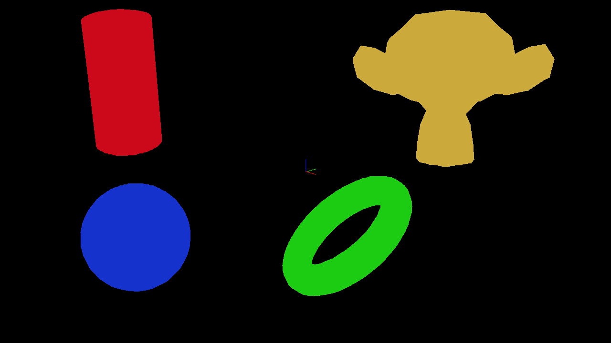

# PWS Engine

This is the repository for the engine itself.



## Dependencies

- [json](https://github.com/nlohmann/json)
- [argagg](https://github.com/vietjtnguyen/argagg)
- [xcb](https://cgit.freedesktop.org/xcb/libxcb/)

```sh
# only run the following 3 commands if you can't get nlohmann/json >= 3.9
wget https://github.com/nlohmann/json/releases/latest/download/include.zip
7z x include.zip
sudo mv include/nlohmann /usr/include

sudo apt-get update

# build dependencies
sudo apt-get install argagg-dev libx11-xcb-dev libxcb-xtest0-dev libxcb-xfixes0-dev libxcb-image0-dev

# unit test dependencies
sudo apt-get install libgtest-dev

# documentation dependencies
sudo apt-get install doxygen

./configure
```

## Contributing

I'm too lazy to make a code of conduct so here are some rules:

- Run `make format` before merging/pushing to the master branch and before pull requests
- Class/typedef/struct names should start with a capital letter
- Dependencies should be handled by the distro's package manager
- Tabs > spaces (clang format should convert these but still)
- The master branch should always contain working code
- The dev branch should contain working/experimental code
- Create a branch with your feature name for broken/WIP code

## Building

```
make
./pws-engine
```

## Documentation

All documentation is handled by doxygen. There is currently a pws-documentation repository, but I (Loek) will attempt to move all documentation to this repo. The doc/ folder is, and always will be in .gitignore to keep repository size down.

